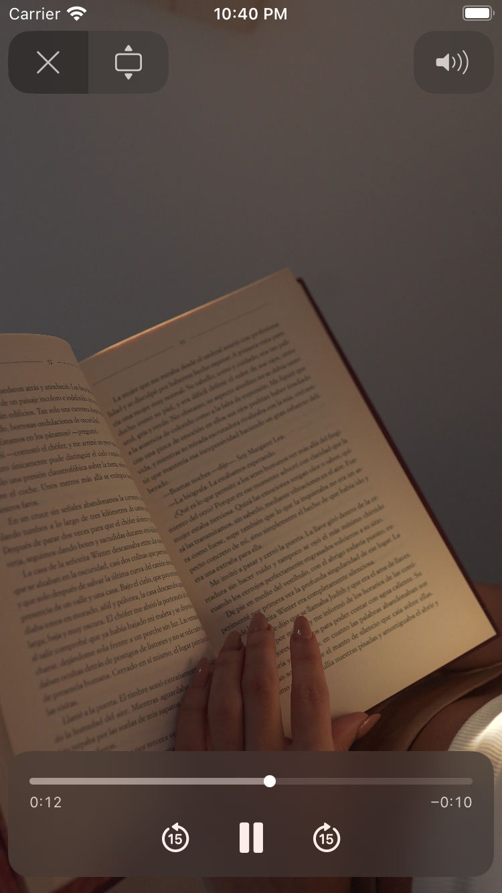

# video_player
My first iOS mobile app :) \\

# Summary 
This is my first iOS mobile application. So, yeah!, it's gonna be simple and let me get down the road. 
## Screenshot

## What I learned ?
- The default project structure 
- The concepts of AppDelegate, UIApplication, ViewController 
- Architecture, Packaging and Deployment section
- Use of info.plist and xcode build system
- iOS mobile Simulators
- AVKit : best in class video playerkit in iOS 🚀
- SwiftUI vs Storyboard 

## Technologies Used
- Xcode IDE
- Swift Programmin language

# Suggestions | Feedback
You can provide your suggestions anytime soon

# contact
Email  : [Ankur Wasnik](mailto:ankurwasnik@icloud.com)
Twitter: [Twitter](https://twitter.com/ankurwasnik358)

